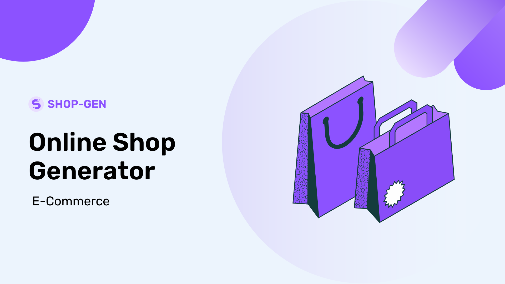

# E-Commerce-Backend

A backend to support my Shop Generator project and provide the data based on the requirement. NodeJS, along with the ExpressJS framework used to build this backend. It provides functionalities like creating a shop, checking the shop presence, fetching the data based on their unique id and others.





## Features

- Provide shop data to Shop-Gen Project
- Data is based on Category and ProductID
- Handle creation of Unique Shop
- Interact with MongoDB using Mongoose
- Checking the existence of shop using its ID.


## Run Locally

Fork and Clone the project

```bash
  git clone https://github.com/abaran803/E-Commerce-Backend.git
```

Go to the project directory

```bash
  cd E-Commerce-Backend
```

Install dependencies

```bash
  npm install
```

`SetUp the Environment Variables, steps given below this`

Start the server

```bash
  npm start
```


## Environment Variables

To run this project, you will need to add the following environment variables to your .env file

`CONNECTION_STRING`

Email me at abaran803@gmail.com for this.


## Developer

- [@abaran803](https://www.github.com/abaran803)


## Tech Stack

**Server:** Node, Express

**Client:** React, Router, Material UI


## Related

Here is the frontend of this project

[Shop-Gen](https://github.com/abaran803/E-Commerce-Backend)


## 🚀 About Me
I'm a final year student and a full stack developer, love to work on JavaScript projects.


## 🔗 Links
[](https://www.linkedin.com/in/ayush-baranwal)
[](https://twitter.com/abaran803)

